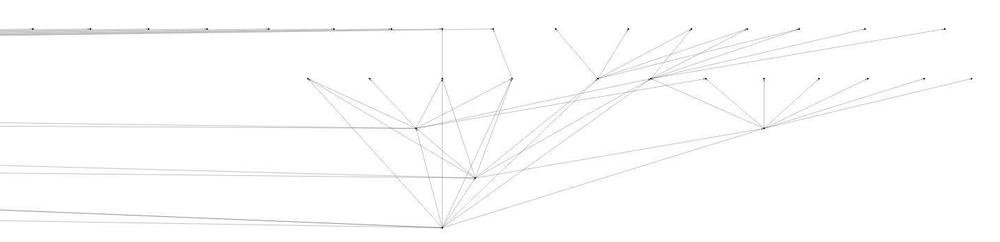
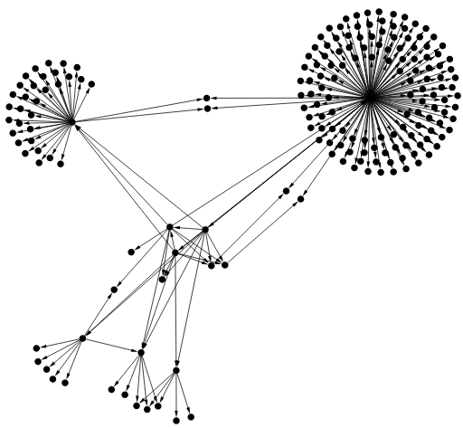
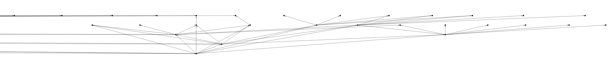
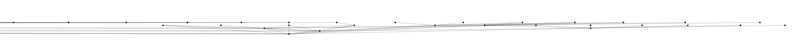
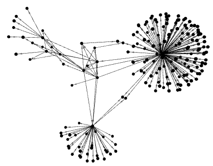
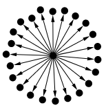
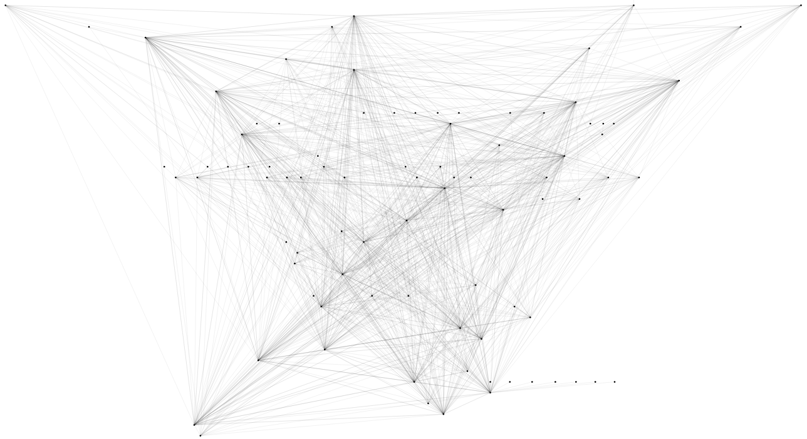
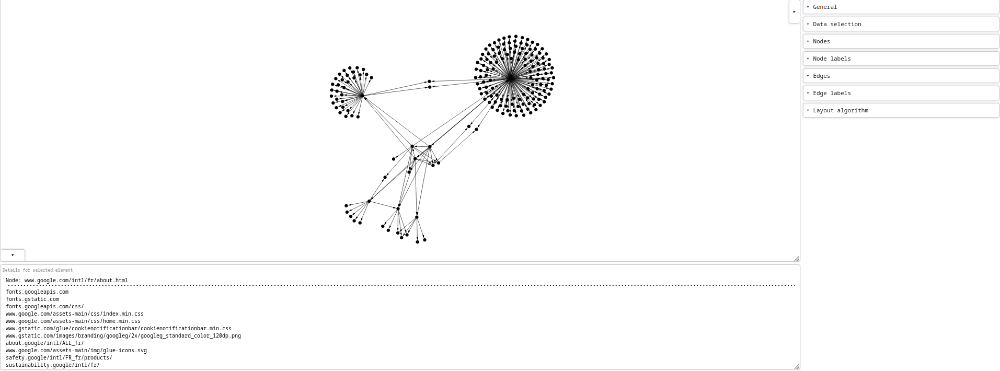

# What is sidemap?
sidemap is a tool that provides an overview of a website via a graph representing all the paths accessible from one of its pages.

# Installation

sidemap is made of Python, that why it is easy to install and use it on every platform. To install it, simply run:
```
git clone https://github.com/0cmenog/sidemap.git
cd sidemap && pip install -r requirements.txt
```

# How to use it

## Easiest way

To run sidemap with the default values, fill the only required parameter:
```
python3 sidemap.py -u <yourStartingPage>
```
The starting page can be a URL, a hostname or a domain name.

## Fine-tune your experience

### Tree or spring

You can choose between a tree (`--tree`) or the default spring representation (`--no-tree`).

| (part of) tree | spring |
|:---:|:---:|
|||

With the tree representation, you can adjust the edges' size to have a more horizontal tree (`--xcoef`) or a more vertical one (`--ycoef`).

| vanilla | `--xcoef 4` | `--ycoef 4` |
|:---:|:---:|:---:|
||||

### Dimensions

You can choose between a default 2 dimensions (`--dimension 2`) or 3 dimensions graph (`--dimension 3`).

| `--dimension 2` | `--dimension 3` |
|:---:|:---:|
|||

### Depth

You can adjust the depth of your map depending of wether you need a long or short vision. The `--depth` option corresponds to the minimum number of hops between the starting node and its farthest node. A prudent value of 2 is set by default.

| `--depth 1` | `--depth 10` |
|:---:|:---:|
|||

### Cache file

To avoid recalculation of the same graph data and take advantage of the different representations, you can store data (`--cache-results`) or use it (`--cache-file`). The cache files are stored under the `cache/` folder.

Write cache file
```
python3 sidemap.py -u <startingPage> --cache-results
```

Use cache file
```
python3 sidemap.py -u <startingPage> --cache-file
```

### Ban file extensions

To avoid some type of files in the graph data (eg. css files), you can use the option `--banexts` to add several extensions to the small predefined list containing `png`, `jpg`, `jpeg`, `ico` and `svg`.

Add `css` and `js` extensions to the list
```
python3 sidemap.py -u <startingPage> --banexts css js
```

### Verbosity

In order to have a better understanding of what is currently going on, you can use the `--verbose` option.

### Combinations

Obviously, you can combine these options to make sidemap yours and have the most adapted graph for your needs. Below are some examples.

```
python3 sidemap.py -u <startPage> --dimension 2 --ycoef 4 --tree --cache-results --depth 10 -be css

python3 sidemap.py -u <startPage> --dimension 3 --cache-results --depth 2

python3 sidemap.py -u <startPage> --tree --ycoef 2 --cache-results --depth 2 --verbose

python3 sidemap.py -u <startPage> --dimension 3 --cache-file
```

### Recap

The `--help` option allows to recap all the possibilities.

```
$ python3 sidemap.py --help
usage: sidemap.py [-h] -u URL [-d DEPTH] [-v | --verbose | --no-verbose] [-t | --tree | --no-tree] [-dim DIMENSION] [-x XCOEF] [-y YCOEF] [-be BANEXTS [BANEXTS ...]] [-cr | --cache-results | --no-cache-results]
                  [-cf | --cache-file | --no-cache-file]

options:
  -h, --help            show this help message and exit
  -u URL, --url URL     url of the siteweb to map
  -d DEPTH, --depth DEPTH
                        maximum hops from the given url
  -v, --verbose, --no-verbose
                        increases verbosity
  -t, --tree, --no-tree
                        displays tree graphs
  -dim DIMENSION, --dimension DIMENSION
                        dimensions of the graph (2d/3d)
  -x XCOEF, --xcoef XCOEF
                        x-axis node gap coefficient
  -y YCOEF, --ycoef YCOEF
                        y-axis node gap coefficient
  -be BANEXTS [BANEXTS ...], --banexts BANEXTS [BANEXTS ...]
                        additional extensions to ban
  -cr, --cache-results, --no-cache-results
                        puts the result in a cache file
  -cf, --cache-file, --no-cache-file
                        uses the appropriate cache file to load graph
```

# Get graph's details

The graph part is mainly built on top of [Gravis](https://github.com/robert-haas/gravis). For more information about Gravis, please refer to [the dependencies section](#dependencies).
The result graph is interactive and served in a browser tab. The window is thus divided into 3 parts: the graph, its attributes and a menu.


## Graph

Nodes of the graph can be dragged and obey to the laws defined in the menu part.
By clicking on nodes or edges, it will reveal their properties in the attributes part.
It is possible to zoom in/out, move around and rotate (if 3d) the graph.

## Attributes

The attributes part can be hidden. It contains the properties of the selected element.

## Menu

The menu can be hidden. It is a panel of settings to interactively adapt the graph. For example, from this menu, it is possible to hide/show labels, adapt nodes/edges size or adapt attraction laws between nodes.

# Roadmap

Done:
- [x] Allow custom cookies input
- [x] Colouring node according to the extension
- [x] Edge thickness proportional to the quantity of references between pages
- [x] List all related pages in an unlinked node
- [x] Manage cache files
- [x] Manage depth
- [x] Manage dots (`./` and `../`) in the URL
- [x] Manage edge size
- [x] Manage extensions to ban
- [x] Put out of scope URL in the properties of the linked node
- [x] Robust given URL parsing (URL encoding, URL parameters, hostname, domain name)
- [x] Search for well known pages
- [x] Size of a node proportional to its total degree

Coming soon:
- [ ] Option `--large/--no-large` to have nodes domain name/hostname related

Need more time:
- [ ] Automatically generated code documentation
- [ ] Loading bar
- [ ] Manage redirections
- [ ] POST and GET parameters keys added to the nodes' attributes
- [ ] Update regex to grab more than URL present in href attribute


# Contribute

The code still self-explanatory for now but a documentation is coming soon.
If you want to contribute, simply submit a pull request by explaining the best as possible what you improve and how.

# Dependencies

The dependencies are listed in the [requirements.txt](requirements.txt) file.
In particular, the graphs are managed by [Gravis](https://github.com/robert-haas/gravis), which allows to create interactive 2d and 3d plots of graphs and networks.

# License

This software is under the GPLv3 license. For more information, please refer to the [LICENSE](LICENSE) file.